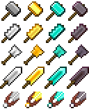

# Practical Tools (1.18.1)

Original repository: https://github.com/astradamus/PracticalTools

This mod adds a few stronger but more expensive versions of the vanilla tools: 
 - **Hammer:** Can mine blocks mineable by a pickaxe in a 3x3 area.
 - **Excavator:** Can dig blocks mineable by a shovel in a 3x3 area.
 - **Saw:** Can cut blocks mineable by an axe in a 3x3 area. Additionally, when used on a tree, will fell the tree entirely.
 - **Shears:** Greatly increased durability.

Each tool comes in iron, gold, diamond and netherite variants. Except for Shears, their recipes match their vanilla equivalents, but use blocks instead of ingots for both crafting and repair. Recipes will be added to your vanilla recipe book as you acquire the appropriate ingots.
