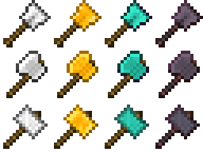
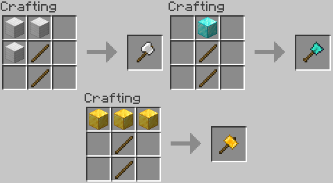

Adds three tools--the excavator, the hammer, and the greataxe. These are 3x3 versions of the shovel, pickaxe, and axe, respectively. The greataxe, when used on a tree, will fell the entire tree at once.

Each tool comes in iron, gold, and diamond variants. Their recipes match their vanilla equivalents, but use blocks instead of ingots for both crafting and repair. Recipes will be added to your vanilla recipe book as you acquire the appropriate ingots.

The greataxe boasts a more accurate tree detection method than I've seen in previous mods, and should never leave floating treetops.

Inspired by the many mods that implement these tools in previous versions of MC, my goal was to make 1.14 a little less vanilla so mod-addicts like myself can finally explore the new features added since 1.12!

Also, here's a shameless plug for my Twitch stream :) https://twitch.tv/neurodr0me